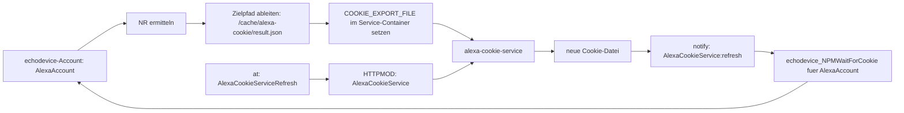

# alexa-cookie-service

REST-Service für Amazon-Alexa-Cookies auf Basis von `alexa-cookie2`.

Der Service stellt einen browsergestützten Login-/Proxy-Flow bereit,
speichert den kompletten Registrierungszustand persistent unter `/data`,
exportiert eine zu `37_echodevice.pm` kompatible JSON-Cachedatei
und kann bestehende Cookies zyklisch oder per API refreshen.

## Enthaltene Komponenten

- Node.js REST-Service
- Dockerfile
- docker-compose.yml
- `.env.example`
- Hilfsskripte für FHEM

## Wichtige Endpunkte

- `GET /healthz` – Healthcheck
- `GET /api/status` – Status ohne Geheimnisse
- `GET /api/state` – gespeicherter Zustand, standardmäßig maskiert
- `GET /api/state?raw=1` – kompletter gespeicherter Zustand
- `POST /api/login/start` – startet den Login-/Proxy-Flow
- `GET /api/login/url` – startet den Login-/Proxy-Flow und liefert die Proxy-URL
- `POST /api/refresh` – Refresh mit `formerRegistrationData`
- `GET /api/cookie` – JSON-Cachedatei im `echodevice`-Schema
- `GET /api/cookie.txt` – nur der Cookie als Text

## Schnellstart

### 1. Konfiguration vorbereiten

```bash
cp .env.example .env
```

Sicheren `AUTH_TOKEN` erzeugen und in `.env` eintragen:

```bash
openssl rand -hex 32
```

Wichtig:
- `PROXY_PUBLIC_HOST` muss die Adresse oder den Hostnamen enthalten, unter dem du den Login-Proxy im Browser wirklich aufrufst
- `AUTH_TOKEN` setzen, wenn die API nicht offen im LAN stehen soll

### Umgebungsvariablen

| Variable | Status | Standardwert | Bedeutung |
| --- | --- | --- | --- |
| `HOST` | Optional | `0.0.0.0` | Bind-Adresse der REST-API im Container |
| `PORT` | Optional | `58080` | Port der REST-API im Container |
| `AUTH_TOKEN` | Empfohlen | leer | Shared Secret fuer `x-auth-token`; im produktiven Betrieb praktisch Pflicht |
| `DATA_DIR` | Optional | `/data` | Basisverzeichnis fuer persistente Servicedaten |
| `STATE_FILE` | Optional | `${DATA_DIR}/alexa-registration.json` | Persistierter Alexa-Registrierungszustand |
| `METADATA_FILE` | Optional | `${DATA_DIR}/service-metadata.json` | Metadaten zur letzten Aktualisierung |
| `COOKIE_EXPORT_FILE` | Optional | `${DATA_DIR}/cookie.json` | Zieldatei fuer die von `37_echodevice.pm` erwartete Cookie-Cachedatei |
| `DEBUG_HTML_DIR` | Optional | `${DATA_DIR}/debug-html` | Ablageort fuer Debug-Artefakte aus dem Login-Flow |
| `AMAZON_PAGE` | Optional | `amazon.de` | Ziel-Region fuer den Amazon-Login |
| `BASE_AMAZON_PAGE` | Optional | `amazon.com` | Basis-Domain fuer den Login-Flow; fuer westliche Regionen in der Regel `amazon.com`, fuer Japan `amazon.co.jp` |
| `ACCEPT_LANGUAGE` | Optional | `de-DE` | Sprach-Header fuer den Login-Flow |
| `PROXY_PUBLIC_HOST` | Pflicht | leer | Von Browsern erreichbare Adresse oder DNS-Name des Docker-Hosts fuer den Login-Proxy |
| `PROXY_LISTEN_BIND` | Optional | `0.0.0.0` | Bind-Adresse des Login-Proxys im Container |
| `PROXY_PORT` | Optional | `58090` | Port des Login-Proxys im Container |
| `PROXY_ONLY` | Optional | `true` | Startet den Login standardmaessig im Proxy-Modus |
| `SETUP_PROXY` | Optional | `true` | Aktiviert die Proxy-Initialisierung fuer den Login-Flow |
| `APP_NAME` | Optional | `FHEM EchoDevice Cookie Service` | Anzeigename des virtuellen Geraets bei Amazon |
| `USE_HERMES` | Optional | `false` | Aktiviert Hermes-spezifisches Verhalten von `alexa-cookie2` |
| `REFRESH_SCHEDULE_HOURS` | Optional | `24` | Intervall fuer den automatischen Refresh |
| `REFRESH_MIN_AGE_HOURS` | Optional | `6` | Mindestalter des Zustands vor einem automatischen Refresh |
| `REQUEST_TIMEOUT_MS` | Optional | `30000` | Timeout fuer Netzwerkoperationen in Millisekunden |
| `LOG_LEVEL` | Optional | `combined` | Format/Level fuer HTTP-Request-Logging |

`PROXY_OWN_IP` wird aus Kompatibilitaetsgruenden vorerst noch als Legacy-Name
akzeptiert, sollte aber durch `PROXY_PUBLIC_HOST` ersetzt werden.

`AMAZON_PAGE` und `BASE_AMAZON_PAGE` haben unterschiedliche Aufgaben:

- `AMAZON_PAGE` ist die eigentliche Ziel-Region fuer das Amazon-Konto, z.B. `amazon.de`.
- `BASE_AMAZON_PAGE` ist die Basis-Domain des Login-Flows.

Empfehlung:

- Fuer Deutschland und die meisten westlichen Laender `AMAZON_PAGE=amazon.de|amazon.fr|amazon.it|amazon.es|amazon.co.uk` passend zur Region setzen, aber `BASE_AMAZON_PAGE=amazon.com` belassen.
- Nur fuer Japan `BASE_AMAZON_PAGE=amazon.co.jp` setzen.
- `BASE_AMAZON_PAGE` nur dann von `amazon.com` abweichend setzen, wenn der Login-Flow mit dem Standardwert nicht funktioniert oder `alexa-cookie2` dies fuer die jeweilige Region verlangt.

### 2. Starten

```bash
docker pull ghcr.io/fhem/alexa-cookie-service:0.2.3
docker compose up -d
```

### 3. Status prüfen

```bash
curl -H "x-auth-token: change-me" http://127.0.0.1:58080/api/status
```

### 4. Login starten

```bash
curl -X POST -H "x-auth-token: change-me" http://127.0.0.1:58080/api/login/start
```

Danach den Proxy im Browser aufrufen:

```text
http://<PROXY_PUBLIC_HOST>:58090/
```

## Datenhaltung

Der komplette Persistenzzustand wird unter `STATE_FILE` gespeichert.
Dieser Zustand ist die Grundlage für spätere Refreshes.

Zusätzlich exportiert der Service:
- `COOKIE_EXPORT_FILE` – JSON im von `37_echodevice.pm` erwarteten Schema
- `METADATA_FILE` – Metadaten zum letzten Update

Wichtig:
Die Datei `COOKIE_EXPORT_FILE` wird absichtlich kompakt in einer einzelnen Zeile geschrieben,
weil `37_echodevice.pm` den JSON-Import zeilenbasiert implementiert und mit mehrzeiligem
Pretty-Print nicht korrekt arbeitet.

Das exportierte JSON hat dieses Schema:

```json
{
  "localCookie": "...",
  "csrf": "...",
  "refreshToken": "...",
  "macDms": "...",
  "formerRegistrationData": { "...": "..." }
}
```

## FHEM-Anbindung

Das Repository enthält generische FHEM-Helfer.
Die konkrete Einbindung von `37_echodevice.pm` bleibt installationsabhängig.

### Docker-Stack mit FHEM erweitern

Ein typisches Setup ist ein gemeinsamer Docker-Stack mit FHEM.
Dabei teilen sich beide Container ein dediziertes Cache-Verzeichnis,
in das der Service die JSON-Cachedatei direkt schreibt.
Wenn der Cookie-Service mit derselben UID/GID wie FHEM läuft,
bleiben Besitzrechte und Schreibzugriffe konsistent.

Funktionsfähiges Beispiel für einen gemeinsamen Compose-Stack:

```yaml
services:
  alexa-cookie-service:
    image: ghcr.io/fhem/alexa-cookie-service:0.2.2
    volumes:
      - ./alexa-cookie-data:/data
      - ./fhem/cache:/opt/fhem/cache
    environment:
      AUTH_TOKEN: change-me
      COOKIE_EXPORT_FILE: /opt/fhem/cache/alexa-cookie.json
      STATE_FILE: /data/alexa-registration.json
      METADATA_FILE: /data/service-metadata.json
      PROXY_PUBLIC_HOST: 192.168.178.10
    env_file:
      - .env
    ports:
      - "58090:58090"
    networks:
      - fhem_cookie_net
    restart: unless-stopped
    user: "6061:6061"

  fhem:
    image: ghcr.io/fhem/fhem-docker:5-bookworm
    volumes:
      - "./fhem/:/opt/fhem/"
      - "./fhem/cache:/opt/fhem/cache"
    environment:
      FHEM_UID: 6061
      FHEM_GID: 6061
      TIMEOUT: 10
      RESTART: 1
      TZ: Europe/Berlin
    ports:
      - "8083:8083"
    networks:
      - fhem_cookie_net
    restart: always

networks:
  fhem_cookie_net:
    driver: bridge
```

In diesem Setup:
- FHEM erreicht die API intern unter `http://alexa-cookie-service:58080`
- der Login-Proxy bleibt über `http://<PROXY_PUBLIC_HOST>:58090/` vom Browser erreichbar
- die aktuelle Cookie-Cachedatei liegt für FHEM direkt unter `./fhem/cache/alexa-cookie/<NR>result.json`

Das Beispiel verwendet `ghcr.io/fhem/fhem-docker:5-bookworm`,
das veröffentlichte Image `ghcr.io/fhem/alexa-cookie-service:0.2.2`
und ein dediziertes Docker-Netz.

Wichtig:
`PROXY_PUBLIC_HOST` ist in diesem Szenario die Adresse oder der DNS-Name des Docker-Hosts,
also des Rechners, auf dem die Container laufen.
Gemeint ist nicht der Containername `alexa-cookie-service`
und auch nicht die interne Docker-IP,
weil der Login-Proxy vom Browser außerhalb des Docker-Netzes erreichbar sein muss.

Wichtig für Dateirechte:
Der Cookie-Service läuft hier mit `user: "6061:6061"`
und damit passend zu `FHEM_UID`/`FHEM_GID`.
So werden neu geschriebene Dateien in `./fhem/cache`
mit kompatiblen Besitzrechten angelegt,
statt als `root`.

Wenn `37_echodevice.pm` im FHEM-Container läuft, liegt der gemeinsame Cache
typischerweise unter `/opt/fhem/cache`.

### Integrationsablauf: `alexa-cookie-service` mit unveraendertem `37_echodevice.pm`

`37_echodevice.pm` importiert externe Cookie-Daten nicht automatisch beim
Start. Das Modul liest die Datei nur ueber die interne Routine
`echodevice_NPMWaitForCookie()`. Ausserdem erwartet es nicht den Dateinamen
`result.json`, sondern immer `<NR>result.json`, also die interne FHEM-Nummer
des `echodevice`-Devices vorangestellt.

Die eigentliche Integration besteht daher aus vier Bausteinen:

1. `echodevice` in FHEM zuerst normal anlegen.
   Erst dadurch existiert das Device und bekommt eine interne `NR`.
   Im folgenden Beispiel heisst das Device `AlexaAccount` und wurde so erzeugt:

   ```text
   defmod AlexaAccount echodevice xxx@xxx.xx xxx
   attr AlexaAccount room Amazon
   ```

2. Ein FHEM-Device anlegen, das den Service anspricht.
   In der Praxis ist das meist ein `HTTPMOD`, das den Refresh-Endpunkt
   aufruft und dabei das Token fuer `x-auth-token` mitliefert.
   Diese API-Ansteuerung ist die Grundlage fuer den externen Refresh,
   aber fuer sich allein noch keine `echodevice`-Integration.

3. Einen periodischen Trigger fuer den Refresh anlegen.
   Dafuer eignet sich typischerweise ein `at`, das z.B. regelmaessig
   `set AlexaCookieService refresh` aufruft.

4. Ein `notify` anlegen, das nach dem Schreiben einer neuen Cookie-Datei
   `echodevice_NPMWaitForCookie()` fuer das betroffene `echodevice`
   aufruft. Erst dieser Schritt uebergibt die extern erzeugte Datei an
   `37_echodevice.pm`.

Die dafuer benoetigten Ableitungen fuer Dateiname und Pfad bleiben:

1. Die `NR` des `echodevice`-Devices in FHEM ermitteln.
   Beispiel:

   ```
   list AlexaAccount NR
   ```

2. Den Dateinamen fuer den externen Cookie-Import auf diese `NR` anpassen.
   Das Modul erwartet:

   ```text
   <fhem_home>/cache/alexa-cookie/<NR>result.json
   ```

   Beispiel fuer `NR = 696` und `fhem_home = /opt/fhem`:

   ```text
   /opt/fhem/cache/alexa-cookie/696result.json
   ```

   Genau dieser Pfad wird spaeter als Wert der Umgebungsvariable
   `COOKIE_EXPORT_FILE` fuer den `alexa-cookie-service`-Container benoetigt.

3. Optional, kann mittels `attr <echodevice> fhem_home` der tatsaechliche Pfad angepasst werden.
   Beispiel:

   ```text
   attr AlexaAccount fhem_home /opt/fhem
   ```

   `AlexaAccount` ist dabei nur ein Beispielname und muss durch den Namen
   deines eigenen `echodevice`-Account-Devices ersetzt werden.

4. Erst danach den `alexa-cookie-service`-Container so einrichten, dass er
   den JSON-Export ueber `COOKIE_EXPORT_FILE` genau auf diesen Dateinamen
   schreibt.
   Beispiel:

   ```yaml
   environment:
     COOKIE_EXPORT_FILE: /opt/fhem/cache/alexa-cookie/696result.json
   ```

   Das blosse Vorhandensein der Datei reicht noch nicht fuer den Import.

5. Das steuernde `HTTPMOD` fuer den `alexa-cookie-service` anlegen.
   Im Beispiel heisst es `AlexaCookieService`.
   Beispiel:

   ```text
   define AlexaCookieService HTTPMOD http://alexa-cookie-service:58080/api/status 300
   attr AlexaCookieService room Amazon

   attr AlexaCookieService replacement01Mode key
   attr AlexaCookieService replacement01Regex %%ACS_TOKEN%%
   attr AlexaCookieService replacement01Value alexa_cookie_service_token

   attr AlexaCookieService reading01JSON ok
   attr AlexaCookieService reading02JSON updatedAt
   attr AlexaCookieService reading03JSON ageHours
   attr AlexaCookieService reading04JSON hasCookie
   attr AlexaCookieService reading05JSON hasRefreshToken
   attr AlexaCookieService reading06JSON proxyUrl
   attr AlexaCookieService reading07JSON message
   attr AlexaCookieService reading08JSON error

   attr AlexaCookieService set01Name loginStart
   attr AlexaCookieService set01NoArg 1
   attr AlexaCookieService set01Method POST
   attr AlexaCookieService set01URL http://alexa-cookie-service:58080/api/login/start
   attr AlexaCookieService set01Header1 x-auth-token: %%ACS_TOKEN%%
   attr AlexaCookieService set01Header2 Content-Type: application/json
   attr AlexaCookieService set01Data {}
   attr AlexaCookieService set01ParseResponse 1

   attr AlexaCookieService set02Name refresh
   attr AlexaCookieService set02NoArg 1
   attr AlexaCookieService set02Method POST
   attr AlexaCookieService set02URL http://alexa-cookie-service:58080/api/refresh
   attr AlexaCookieService set02Header1 x-auth-token: %%ACS_TOKEN%%
   attr AlexaCookieService set02Header2 Content-Type: application/json
   attr AlexaCookieService set02Data {}
   attr AlexaCookieService set02ParseResponse 1

   attr AlexaCookieService get01Name loginUrl
   attr AlexaCookieService get01URL http://alexa-cookie-service:58080/api/login/url
   attr AlexaCookieService get01Header1 x-auth-token: %%ACS_TOKEN%%

   attr AlexaCookieService showMatched 1
   attr AlexaCookieService showError 1
   attr AlexaCookieService room Amazon

   ```

6. Das AUTH-Shared-Secret hinterlegen. 
   Dafuer muss `set AlexaCookieService storeKeyValue ...`
   verwendet werden. An dieser Stelle wird das zuvor per
   `openssl rand -hex 32` erzeugte Secret eingesetzt.
   Beispiel:

   ```text
   set AlexaCookieService storeKeyValue alexa_cookie_service_token change-me
   ```

7. Einen periodischen Trigger anlegen, der den Refresh ueber dieses `HTTPMOD`
   ausloest.
   Beispiel:

   ```text
   define at_AlexaCookieServiceRefresh at +*16:00:00 set AlexaCookieService refresh
   attr at_AlexaCookieServiceRefresh room Amazon
   ```

8. Das Attribut `intervallogin` des `echodevice`-Account-Devices auf einen
   Wert in Sekunden setzen, der groesser als das Intervall des `at` ist,
   damit der externe Refresh vorher greift.
   Beispiel bei `at +*16:00:00`:

   ```text
   attr AlexaAccount intervallogin 57660
   ```

9. Ein `notify` anlegen, dessen Regex auf den Namen des `HTTPMOD`
   `AlexaCookieService` verweist und das danach den Import in
   `37_echodevice.pm` anstoesst.
   Beispiel:

   ```text
   define n_AlexaAccountCookieImport notify AlexaCookieService:refresh { $main::NPMLoginTyp = 'NPM Login Refresh external';; echodevice_NPMWaitForCookie($defs{$NAME});; }
   attr n_AlexaAccountCookieImport room Amazon
   ```

10. Nachdem alle beteiligten Devices eingerichtet sind, den Import fuer das
   Account-Device einmal manuell ausfuehren.
   Beispiel:

   ```text
   { $main::NPMLoginTyp = 'NPM Login Refresh external';; echodevice_NPMWaitForCookie($defs{'AlexaAccount'});; }
   ```

Das Zusammenspiel sieht dann so aus:



Der Name `AlexaAccount` im Beispiel bezieht sich auf dieses Define:

```text
defmod AlexaAccount echodevice xxx@xxx.xx xxx
attr AlexaAccount room Amazon
```

Erst nach dem Trigger des `notify` uebernimmt `37_echodevice.pm` die Datei
in seine internen Werte.
Danach sollten im Device unter anderem `COOKIE_TYPE = NPM_Login` und ein
gesetztes `.COOKIE` sichtbar werden.


## Alternaive Zugrifswege

Hilfsskripte:
- `scripts/fhem_fetch_cookie.sh`
- `scripts/fhem_dump_cookie_json.sh`
- `scripts/example_fhem_notify.txt`

Typische Varianten:

### Variante A: FHEM spiegelt nur den Cookie lokal

```bash
SERVICE_URL=http://127.0.0.1:58080 AUTH_TOKEN=change-me OUT_FILE=/opt/fhem/cache/alexa-cookie-external-cookie.txt ./scripts/fhem_fetch_cookie.sh
```

### Variante B: FHEM spiegelt den kompletten Zustand lokal

```bash
SERVICE_URL=http://127.0.0.1:58080 AUTH_TOKEN=change-me OUT_FILE=/opt/fhem/cache/alexa-cookie-external-state.json ./scripts/fhem_dump_cookie_json.sh
```

## Sicherheitshinweise

- Die REST-API liefert Geheimnisse. Setze `AUTH_TOKEN`.
- Stelle den Service idealerweise nur im internen Netz bereit.
- Nutze bei Remote-Zugriff einen Reverse Proxy mit TLS und zusätzlicher Authentifizierung.
- Lege `/data` auf ein persistentes Volume.

## Bekannte Grenzen

- Amazon kann Login-Flows jederzeit ändern.
- MFA, Captcha und Regionseffekte bleiben möglich.
- Der initiale Login ist absichtlich browsergestützt; das ist robuster als ein erzwungener Headless-Flow.

## Einbindung in  `37_echodevice.pm`

`37_echodevice.pm` liest die Cookie-Daten aus einer lokalen Datei.
Der Service erzeugt und erneuert diese Daten.
FHEM triggert bei Bedarf den Refresh
und schreibt oder verwendet die exportierte Cachedatei lokal:
- den `AUTH_TOKEN` aus der `.env` in FHEM hinterlegen
- aus FHEM `POST /api/refresh` aufrufen
- danach die aktuelle Cookie-Cachedatei nach `/opt/fhem/cache/...` spiegeln
- `echodevice` unverändert auf diese lokale Datei zeigen lassen

Wichtig: Es gibt keinen separaten Endpoint, der den API-Key ausgibt. Der Wert ist identisch mit `AUTH_TOKEN` aus der `.env` des Containers/Services.

### Funktionsfähiges FHEM-Beispiel ohne HTTPMOD

Das Beispiel ruft den Refresh-Endpunkt auf
und spiegelt danach die JSON-Cachedatei in eine lokale Datei,
die `37_echodevice.pm` direkt verwenden kann.
Wenn FHEM und `alexa-cookie-service` in getrennten Containern laufen,
aber im selben Docker-Netz sind, muss hier der Docker-Service-Name
statt `127.0.0.1` verwendet werden:

```perl
define AlexaCookieServiceRefresh at +*06:00:00 {
  my $token = getKeyValue('alexa_cookie_service_token');;
  return 'missing token' if !$token;;
  my $base = 'http://alexa-cookie-service:58080';;

  my $refresh = qx(curl -fsS -X POST -H 'x-auth-token: $token' $base/api/refresh 2>&1);;
  return "refresh failed: $refresh" if $? != 0;;

  my $cookie_json = qx(curl -fsS -H 'x-auth-token: $token' $base/api/cookie 2>&1);;
  return "cookie fetch failed: $cookie_json" if $? != 0;;

  my $file = '/opt/fhem/cache/alexa-cookie/result.json';;
  FileWrite($file, $cookie_json);;
  Log 1, "AlexaCookieServiceRefresh wrote cookie json to $file";;
}
attr AlexaCookieServiceRefresh room Amazon
```

`37_echodevice.pm` muss dann auf `/opt/fhem/cache/alexa-cookie/result.json` zeigen.

Wenn beide Container wie oben gezeigt denselben Cache teilen,
kann das Beispiel noch einfacher werden,
weil der Service die Cachedatei schon selbst nach `/opt/fhem/cache/result.json` schreibt.
Der reine Refresh kann so erfolgen:

```perl
define AlexaCookieServiceRefresh at +*06:00:00 {
  my $token = getKeyValue('alexa_cookie_service_token');;
  return 'missing token' if !$token;;
  my $base = 'http://alexa-cookie-service:58080';;

  my $refresh = qx(curl -fsS -X POST -H 'x-auth-token: $token' $base/api/refresh 2>&1);;
  return "refresh failed: $refresh" if $? != 0;;

  Log 1, 'AlexaCookieServiceRefresh refreshed cookie via shared docker volume';;
}
attr AlexaCookieServiceRefresh room Amazon
```

In diesem Fall verwendet `37_echodevice.pm` direkt `/opt/fhem/cache/alexa-cookie/<NR>result.json`.


#### Verwendung

Der Login-/Proxy-Flow kann dann direkt aus FHEM gestartet werden:

```text
set AlexaCookieService loginStart
```
Die Antwort wird nur dann in Readings ausgewertet,
wenn `set01ParseResponse 1` gesetzt ist.
Danach stehen insbesondere `proxyUrl`, `message` oder `error` als Readings zur Verfuegung.
Die URL aus `proxyUrl` muss anschliessend im Browser geoeffnet werden.

Alternativ kann die Proxy-URL explizit per `get` abgefragt werden:

```text
get AlexaCookieService loginStart
```

Suche im reading message die Adresse, welche im Browser aufgerufen werden muss.

Sobald im Browser steh, das Fenster kann geschlossen werden, einen Refresh des bereits gespeicherten Zustands starten:

```text
set AlexaCookieService refresh
```

#### 3a. Refresh per at ausloesen

Wenn `37_echodevice.pm` und `alexa-cookie-service` denselben Cache
unter `/opt/fhem/cache/alexa-cookie.json` verwenden, kann ein `notify`
direkt den HTTPMOD-Refresh ausloesen:

Da der Refresh periodisch laufen soll, ist ein `at`
einfache in der Umsetzung:

```perl
define at_AlexaCookieServiceRefresh at +*16:00:00 set AlexaCookieService refresh
attr at_AlexaCookieServiceRefresh room Amazon
```

Die eigentliche `echodevice`-Integration entsteht erst
dadurch, dass der Service auf `<NR>result.json` schreibt und anschliessend
ein separates `notify` `echodevice_NPMWaitForCookie()` ausloest.

#### 4. Hinweise fuer Docker-Setups

Wenn FHEM und `alexa-cookie-service` in Containern im selben Docker-Netz laufen, muss der Service-Name verwendet werden.

```text
http://alexa-cookie-service:58080
```

Wichtig:
- der API-Port des Services ist standardmaessig `58080`
- der Browser-Login selbst laeuft ueber den Proxy-Port `58090`
- fuer die Auswertung von `set`-Antworten ist `setXXParseResponse 1` noetig

Ein minimales Shell-Beispiel liegt zusaetzlich in `scripts/example_fhem_notify.txt`.
