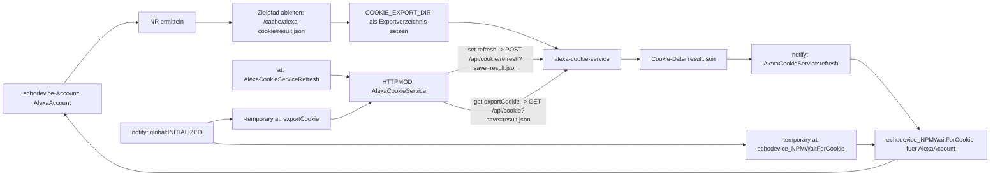

# alexa-cookie-service

REST-Service für Amazon-Alexa-Cookies auf Basis von `alexa-cookie2`.

Der Service stellt einen browsergestützten Login-/Proxy-Flow bereit,
speichert den kompletten Registrierungszustand persistent unter `/data`,
liefert bei Bedarf eine zu `37_echodevice.pm` kompatible JSON-Cachedatei
und kann bestehende Cookies zyklisch oder per API refreshen.

## Enthaltene Komponenten

- Node.js REST-Service
- Dockerfile
- docker-compose.yml
- `.env.example`
- Hilfsskripte für FHEM

## Wichtige Endpunkte

- `GET /healthz` – Liveness-Check, liefert immer 200 wenn der Prozess laeuft
- `GET /api/status` – Status ohne Geheimnisse, fuer Readiness und Login-Zustand
- `GET /api/state` – gespeicherter Zustand, standardmäßig maskiert
- `GET /api/state?raw=1` – kompletter gespeicherter Zustand
- `POST /api/cookie/login/start` – startet den Login-/Proxy-Flow
- `GET /api/cookie/login/url` – startet den Login-/Proxy-Flow und liefert die Proxy-URL
- `POST /api/cookie/refresh` – Refresh mit `formerRegistrationData`, optional `save=<filename>`
- `GET /api/cookie` – JSON-Cachedatei im `echodevice`-Schema, optional `save=<filename>`
- `GET /api/cookie/text` – nur der Cookie als Text

Die bisherigen Pfade `/api/login/start`, `/api/login/url`, `/api/refresh` und `/api/cookie.txt`
sind abgekündigt.

## Schnellstart

### 1. Konfiguration vorbereiten

```bash
cp .env.example .env
```

Sicheren `AUTH_TOKEN` erzeugen und in `.env` eintragen:

```bash
openssl rand -hex 32
```

Wichtig:
- `PROXY_PUBLIC_HOST` muss die Adresse oder den Hostnamen enthalten, unter dem du den Login-Proxy im Browser wirklich aufrufst
- `AUTH_TOKEN` setzen, wenn die API nicht offen im LAN stehen soll

### Umgebungsvariablen

| Variable | Status | Standardwert | Bedeutung |
| --- | --- | --- | --- |
| `HOST` | Optional | `0.0.0.0` | Bind-Adresse der REST-API im Container |
| `PORT` | Optional | `58080` | Port der REST-API im Container |
| `AUTH_TOKEN` | Empfohlen | leer | Shared Secret fuer `x-auth-token`; im produktiven Betrieb praktisch Pflicht |
| `DATA_DIR` | Optional | `/data` | Basisverzeichnis fuer persistente Servicedaten |
| `STATE_FILE` | Optional | `${DATA_DIR}/alexa-registration.json` | Persistierter Alexa-Registrierungszustand |
| `METADATA_FILE` | Optional | `${DATA_DIR}/service-metadata.json` | Metadaten zur letzten Aktualisierung |
| `COOKIE_EXPORT_DIR` | Optional | `${DATA_DIR}/cookie-export` | Exportverzeichnis fuer per `save=<filename>` erzeugte Cookie-Dateien |
| `DEBUG_HTML_DIR` | Optional | `${DATA_DIR}/debug-html` | Ablageort fuer Debug-Artefakte aus dem Login-Flow |
| `AMAZON_PAGE` | Optional | `amazon.de` | Ziel-Region fuer den Amazon-Login |
| `BASE_AMAZON_PAGE` | Optional | `amazon.com` | Basis-Domain fuer den Login-Flow; fuer westliche Regionen in der Regel `amazon.com`, fuer Japan `amazon.co.jp` |
| `ACCEPT_LANGUAGE` | Optional | `de-DE` | Sprach-Header fuer den Login-Flow |
| `PROXY_PUBLIC_HOST` | Pflicht | leer | Von Browsern erreichbare Adresse oder DNS-Name des Docker-Hosts fuer den Login-Proxy |
| `PROXY_LISTEN_BIND` | Optional | `0.0.0.0` | Bind-Adresse des Login-Proxys im Container |
| `PROXY_PORT` | Optional | `58090` | Port des Login-Proxys im Container |
| `PROXY_ONLY` | Optional | `true` | Startet den Login standardmaessig im Proxy-Modus |
| `SETUP_PROXY` | Optional | `true` | Aktiviert die Proxy-Initialisierung fuer den Login-Flow |
| `APP_NAME` | Optional | `FHEM EchoDevice Cookie Service` | Anzeigename des virtuellen Geraets bei Amazon |
| `USE_HERMES` | Optional | `false` | Aktiviert Hermes-spezifisches Verhalten von `alexa-cookie2` |
| `REFRESH_SCHEDULE_HOURS` | Optional | `24` | Intervall fuer den automatischen Refresh |
| `REFRESH_MIN_AGE_HOURS` | Optional | `6` | Mindestalter des Zustands vor einem automatischen Refresh |
| `REQUEST_TIMEOUT_MS` | Optional | `30000` | Timeout fuer Netzwerkoperationen in Millisekunden |
| `LOG_LEVEL` | Optional | `combined` | Format/Level fuer HTTP-Request-Logging |

`AMAZON_PAGE` und `BASE_AMAZON_PAGE` haben unterschiedliche Aufgaben:

- `AMAZON_PAGE` ist die eigentliche Ziel-Region fuer das Amazon-Konto, z.B. `amazon.de`.
- `BASE_AMAZON_PAGE` ist die Basis-Domain des Login-Flows.

Empfehlung:

- Fuer Deutschland und die meisten westlichen Laender `AMAZON_PAGE=amazon.de|amazon.fr|amazon.it|amazon.es|amazon.co.uk` passend zur Region setzen, aber `BASE_AMAZON_PAGE=amazon.com` belassen.
- Nur fuer Japan `BASE_AMAZON_PAGE=amazon.co.jp` setzen.
- `BASE_AMAZON_PAGE` nur dann von `amazon.com` abweichend setzen, wenn der Login-Flow mit dem Standardwert nicht funktioniert oder `alexa-cookie2` dies fuer die jeweilige Region verlangt.

### 2. Starten

```bash
docker pull ghcr.io/fhem/alexa-cookie-service:0.3.1
docker compose up -d
```

### 3. Status prüfen

```bash
curl -H "x-auth-token: change-me" http://127.0.0.1:58080/api/status
```

### 4. Login starten

```bash
curl -X POST -H "x-auth-token: change-me" http://127.0.0.1:58080/api/cookie/login/start
```

Danach den Proxy im Browser aufrufen:

```text
http://<PROXY_PUBLIC_HOST>:58090/
```

## Datenhaltung

Der komplette Persistenzzustand wird unter `STATE_FILE` gespeichert.
Dieser Zustand ist die Grundlage für spätere Refreshes.

Zusätzlich schreibt der Service:
- `METADATA_FILE` – Metadaten zum letzten Update

Wichtig:
Wenn `save=<filename>` fuer `POST /api/cookie/refresh` oder `GET /api/cookie` verwendet wird,
wird die JSON-Datei absichtlich kompakt in einer einzelnen Zeile geschrieben,
weil `37_echodevice.pm` den JSON-Import zeilenbasiert implementiert und mit mehrzeiligem
Pretty-Print nicht korrekt arbeitet.
`save` ist dabei nur ein Dateiname, kein Pfad.
Die Datei wird immer unterhalb von `COOKIE_EXPORT_DIR` gespeichert.
`COOKIE_EXPORT_FILE` wird aus Kompatibilitaetsgruenden vorerst noch als Legacy-Name akzeptiert.

Das exportierte JSON hat dieses Schema:

```json
{
  "localCookie": "...",
  "csrf": "...",
  "refreshToken": "...",
  "macDms": "...",
  "formerRegistrationData": { "...": "..." }
}
```

Verhalten der Endpunkte:

- Login schreibt nur `STATE_FILE` und `METADATA_FILE`
- `POST /api/cookie/refresh` schreibt keine Exportdatei ohne `save=<filename>`
- `GET /api/cookie` liefert das JSON im Response und speichert es nur mit `save=<filename>`
- `GET /api/cookie/text` liefert den Cookie als eine Zeile Text
- alle JSON-Ausgaben/-Dateien fuer das `echodevice`-Schema sind kompakt und ohne Zeilenumbrueche
- `save=696result.json` speichert bei `COOKIE_EXPORT_DIR=/opt/fhem/cache/alexa-cookie` nach `/opt/fhem/cache/alexa-cookie/696result.json`

Beispiele:

```bash
curl -X POST -H "x-auth-token: change-me" \
  "http://127.0.0.1:58080/api/cookie/refresh?save=696result.json"
```

```bash
curl -H "x-auth-token: change-me" \
  "http://127.0.0.1:58080/api/cookie?save=696result.json"
```

## Architektur und Motivation

Der Service ist bewusst als separater Node.js-Container aufgebaut
und nicht als Erweiterung innerhalb des FHEM-Docker-Containers.

Der Hauptgrund ist die klare Trennung der Laufzeitumgebungen:

- der FHEM-Container ist primaer fuer Perl und eine moeglichst klassische,
  gut wartbare FHEM-Umgebung gedacht
- `alexa-cookie2` bringt eine eigene Node.js-Runtime, eigene Abhaengigkeiten
  und einen eigenen Update-Zyklus mit
- ein gemeinsames Image wuerde zwei technisch unterschiedliche Aufgabenbereiche
  vermischen und dadurch Wartung, Debugging und Updates unnoetig verkomplizieren

Seit Version 5 des FHEM-Images ist zudem kein Node Package Manager mehr im
FHEM-(Perl-)Container enthalten.
Fuer Node-basierte Helfer musste deshalb bislang meist ein eigenes,
angepasstes FHEM-Image gebaut werden.

Dieses Projekt verfolgt stattdessen bewusst ein Service-Muster:

```text
FHEM / echodevice -> HTTP/REST -> alexa-cookie-service -> Amazon
```

Das bedeutet:

- `37_echodevice.pm` bleibt im normalen FHEM-Container
- der Node.js-Dienst kapselt Login-, Refresh- und Cookie-Export-Funktionen
- die Kopplung erfolgt ueber eine klar definierte HTTP-Schnittstelle
- beide Container koennen getrennt gebaut, aktualisiert, neu gestartet und
  debuggt werden

Die Trennung ist damit keine unnoetige Zusatzkomplexitaet,
sondern eine bewusste Designentscheidung zugunsten von Stabilitaet,
Wartbarkeit und klaren Zustaendigkeiten.

## FHEM-Anbindung

Das Repository enthält generische FHEM-Helfer.
Die konkrete Einbindung von `37_echodevice.pm` bleibt installationsabhängig.

### Docker-Stack mit FHEM erweitern

Ein typisches Setup ist ein gemeinsamer Docker-Stack mit FHEM.
Dabei teilen sich beide Container ein dediziertes Exportverzeichnis,
in das der Service JSON nur dann schreibt, wenn `save=<filename>` mitgegeben wird.
Wenn der Cookie-Service mit derselben UID/GID wie FHEM läuft,
bleiben Besitzrechte und Schreibzugriffe konsistent.

Funktionsfähiges Beispiel für einen gemeinsamen Compose-Stack:

```yaml
services:
  alexa-cookie-service:
    image: ghcr.io/fhem/alexa-cookie-service:0.3.1
    volumes:
      - ./alexa-cookie-data:/data
      - ./fhem/cache/alexa-cookie:/opt/fhem/cache/alexa-cookie
    environment:
      AUTH_TOKEN: change-me
      COOKIE_EXPORT_DIR: /opt/fhem/cache/alexa-cookie
      PROXY_PUBLIC_HOST: 192.168.178.10
    ports:
      - "58090:58090"
    networks:
      - fhem_cookie_net
    restart: unless-stopped
    user: "6061:6061"

  fhem:
    image: ghcr.io/fhem/fhem-minimal-docker:5.2.7-bookworm
    volumes:
      - "./fhem/:/opt/fhem/"
      - "./fhem/cache/alexa-cookie:/opt/fhem/cache/alexa-cookie"
    environment:
      FHEM_UID: 6061
      FHEM_GID: 6061
      TIMEOUT: 10
      RESTART: 1
      TZ: Europe/Berlin
    ports:
      - "8083:8083"
    networks:
      - fhem_cookie_net
    restart: always

networks:
  fhem_cookie_net:
    driver: bridge
```


In diesem Setup:
- FHEM erreicht die API intern unter `http://alexa-cookie-service:58080`
- der Login-Proxy bleibt über `http://<PROXY_PUBLIC_HOST>:58090/` vom Browser erreichbar
- das gemeinsam genutzte Exportverzeichnis liegt bei `./fhem/cache/alexa-cookie`
- der konkrete Exportname wird per `save=<filename>` an den API-Aufruf uebergeben
- das AUTH Token "change-me" sollte durch eine zufällige Zeichenkette ersetzt werden:
`openssl rand -hex 32` liefert eine solche Zeichenkette.

Das Beispiel verwendet `ghcr.io/fhem/fhem-minimal-docker:5.2.7-bookworm`,
das veröffentlichte Image `ghcr.io/fhem/alexa-cookie-service:0.3.1`
und ein dediziertes Docker-Netz.

Wichtig:
`PROXY_PUBLIC_HOST` ist in diesem Szenario die Adresse oder der DNS-Name des Docker-Hosts,
also des Rechners, auf dem die Container laufen.
Gemeint ist nicht der Containername `alexa-cookie-service`
und auch nicht die interne Docker-IP,
weil der Login-Proxy vom Browser außerhalb des Docker-Netzes erreichbar sein muss.

Wichtig für Dateirechte:
Der Cookie-Service läuft hier mit `user: "6061:6061"`
und damit passend zu `FHEM_UID`/`FHEM_GID`.
So werden neu geschriebene Dateien in `./fhem/cache/alexa-cookie`
mit kompatiblen Besitzrechten angelegt,
statt als `root`.

Wenn `37_echodevice.pm` im FHEM-Container läuft, liegt das gemeinsame Exportverzeichnis
typischerweise unter `/opt/fhem/cache/alexa-cookie`.

### Integrationsablauf: `alexa-cookie-service` mit unveraendertem `37_echodevice.pm`

`37_echodevice.pm` importiert externe Cookie-Daten nicht automatisch beim
Start.
Das Modul liest die Datei nur ueber die interne Routine
`echodevice_NPMWaitForCookie()`. 
Ausserdem erwartet es keinen festen Standardnamen wie `result.json`, sondern
einen expliziten Dateinamen im Format `<NR>result.json`, also die interne
FHEM-Nummer des `echodevice`-Devices vorangestellt.

Die eigentliche Integration besteht daher aus vier Bausteinen:

1. `echodevice` in FHEM zuerst normal anlegen.
   Erst dadurch existiert das Device und bekommt eine interne `NR`.
   Im folgenden Beispiel heisst das Device `AlexaAccount` und wurde so erzeugt:

   ```text
   defmod AlexaAccount echodevice xxx@xxx.xx xxx
   attr AlexaAccount room Amazon
   ```

2. Ein FHEM-Device anlegen, das den Service anspricht.
   In der Praxis ist das meist ein `HTTPMOD`, das den Refresh-Endpunkt
   aufruft und dabei das Token fuer `x-auth-token` mitliefert.
   Diese API-Ansteuerung ist die Grundlage fuer den externen Refresh,
   aber fuer sich allein noch keine `echodevice`-Integration.

3. Einen periodischen Trigger fuer den Refresh anlegen.
   Dafuer eignet sich typischerweise ein `at`, das z.B. regelmaessig
   `set AlexaCookieService refresh` aufruft.

4. Ein `notify` anlegen, das nach dem Schreiben einer neuen Cookie-Datei
   `echodevice_NPMWaitForCookie()` fuer das betroffene `echodevice`
   aufruft. Erst dieser Schritt uebergibt die extern erzeugte Datei an
   `37_echodevice.pm`.

Die `NR` des betroffenen `echodevice` muss dynamisch in FHEM ermittelt
und als `save=<filename>` an den API-Aufruf uebergeben werden.
Der Dateiname darf nicht dauerhaft als feste Zahl gespeichert werden,
weil sich die interne FHEM-`NR` nach `rereadcfg` oder Konfigurationsaenderungen verschieben kann.
Das Modul erwartet weiterhin:

```text
<fhem_home>/cache/alexa-cookie/<NR>result.json
```

Beispiel fuer `NR = 696` und `fhem_home = /opt/fhem`:

```text
/opt/fhem/cache/alexa-cookie/696result.json
```

   Der Dateiname `696result.json` wird spaeter als `save`-Parameter benoetigt.

   Optional, kann mittels `attr <echodevice> fhem_home` der tatsaechliche Pfad angepasst werden.
   Beispiel:

   ```text
   attr AlexaAccount fhem_home /opt/fhem
   ```

   `AlexaAccount` ist dabei nur ein Beispielname und muss durch den Namen
   deines eigenen `echodevice`-Account-Devices ersetzt werden.

1. Den `alexa-cookie-service`-Container so einrichten, dass
   `COOKIE_EXPORT_DIR` auf das gemeinsame cache Verzeichnis von alexa-cookie zeigt.
   Beispiel:

   ```yaml
   environment:
     COOKIE_EXPORT_DIR: /opt/fhem/cache/alexa-cookie
   ```

   Das bloße Vorhandensein des Verzeichnisses reicht noch nicht fuer den Import;
   entscheidend ist der passende `save=<filename>`-Aufruf.

2. Um `alexa-cookie-service` aus FHEM heraus steuern zu können, nutzen wir HTTPMOD.
   Das steuernde `HTTPMOD` fuer den `alexa-cookie-service` anlegen.
   Im Beispiel heisst es `AlexaCookieService`.
   Beispiel:

   ```text
   define AlexaCookieService HTTPMOD http://alexa-cookie-service:58080/api/status 300
   attr AlexaCookieService room Amazon

   attr AlexaCookieService replacement01Mode key
   attr AlexaCookieService replacement01Regex %%ACS_TOKEN%%
   attr AlexaCookieService replacement01Value alexa_cookie_service_token

   attr AlexaCookieService replacement02Mode key
   attr AlexaCookieService replacement02Regex %%ACS_EXPORT_NAME%%
   attr AlexaCookieService replacement02Value alexa_cookie_service_export_name

   attr AlexaCookieService requestHeader1 x-auth-token: %%ACS_TOKEN%%

   attr AlexaCookieService reading01JSON ok
   attr AlexaCookieService reading02JSON updatedAt
   attr AlexaCookieService reading03JSON ageHours
   attr AlexaCookieService reading04JSON hasCookie
   attr AlexaCookieService reading05JSON hasRefreshToken
   attr AlexaCookieService reading06JSON proxyUrl
   attr AlexaCookieService reading07JSON message
   attr AlexaCookieService reading08JSON error

   attr AlexaCookieService set01Name loginStart
   attr AlexaCookieService set01NoArg 1
   attr AlexaCookieService set01Method POST
   attr AlexaCookieService set01URL http://alexa-cookie-service:58080/api/cookie/login/start
   attr AlexaCookieService set01Header1 x-auth-token: %%ACS_TOKEN%%
   attr AlexaCookieService set01Header2 Content-Type: application/json
   attr AlexaCookieService set01Data {}
   attr AlexaCookieService set01ParseResponse 1

   attr AlexaCookieService set02Name refresh
   attr AlexaCookieService set02NoArg 1
   attr AlexaCookieService set02Method POST
   attr AlexaCookieService set02URL http://alexa-cookie-service:58080/api/cookie/refresh?save=%%ACS_EXPORT_NAME%%
   attr AlexaCookieService set02Header1 x-auth-token: %%ACS_TOKEN%%
   attr AlexaCookieService set02Header2 Content-Type: application/json
   attr AlexaCookieService set02Data {}
   attr AlexaCookieService set02ParseResponse 1

   attr AlexaCookieService get01Name loginUrl
   attr AlexaCookieService get01URL http://alexa-cookie-service:58080/api/cookie/login/url
   attr AlexaCookieService get01Header1 x-auth-token: %%ACS_TOKEN%%

   attr AlexaCookieService get02Name exportCookie
   attr AlexaCookieService get02URL http://alexa-cookie-service:58080/api/cookie?save=%%ACS_EXPORT_NAME%%
   attr AlexaCookieService get02Header1 x-auth-token: %%ACS_TOKEN%%

   attr AlexaCookieService stateFormat {my $ok = ReadingsVal($name,"ok",0);; my $cookie = ReadingsVal($name,"hasCookie",0);; my $refresh = ReadingsVal($name,"hasRefreshToken",0);; my $age = ReadingsVal($name,"ageHours","-");; my $err = ReadingsVal($name,"error","");; !$ok && $err ne "" ? "error: $err" : !$ok ? "not initialized" : ($cookie && $refresh) ? "ready, age ${age}h" : ($cookie ? "cookie only, age ${age}h" : "login required")}
   attr AlexaCookieService showMatched 1
   attr AlexaCookieService showError 1
   attr AlexaCookieService room Amazon
   attr AlexaCookieService timeout 8
   ```

3. Das AUTH-Shared-Secret hinterlegen.
   Dafuer muss `set AlexaCookieService storeKeyValue ...` verwendet werden.
   An dieser Stelle wird das zuvor per `openssl rand -hex 32` erzeugte Secret
   anstelle von `change-me` eingesetzt.

   ```text
   set AlexaCookieService storeKeyValue alexa_cookie_service_token change-me
   ```

   Der Exportname darf nicht dauerhaft als feste Zahl gepflegt werden.
   Die interne FHEM-`NR` des `echodevice`-Account-Devices kann sich nach
   `rereadcfg` oder Konfigurationsaenderungen verschieben. Deshalb setzen die
   folgenden Trigger `alexa_cookie_service_export_name` jeweils unmittelbar
   vor dem Export aus der aktuellen `NR` von `AlexaAccount`.

4. Einen periodischen Trigger anlegen, der den Refresh des Cookies ueber dieses `HTTPMOD`
   ausloest.
   Beispiel:

   ```text
   define at_AlexaCookieServiceRefresh at +*16:00:00 { my $nr = $defs{'AlexaAccount'}{NR};; setKeyValue('alexa_cookie_service_export_name', "${nr}result.json");; fhem('set AlexaCookieService refresh');; }
   attr at_AlexaCookieServiceRefresh room Amazon
   ```

5. Das Attribut `intervallogin` des `echodevice`-Account-Devices auf einen
   Wert in Sekunden setzen, der groesser als das Intervall des `at` ist,
   damit der externe Refresh vorher greift.
   Beispiel bei `at +*16:00:00`:

   ```text
   attr AlexaAccount intervallogin 57660
   ```

6. Ein `notify` anlegen, dessen Regex auf den Namen des `HTTPMOD`
   `AlexaCookieService` verweist und das den Import in
   `37_echodevice.pm` anstoesst.
   Beispiel:

   ```text
   define n_AlexaAccountCookieImport notify AlexaCookieService:refresh { $main::NPMLoginTyp = "NPM Login Refresh external";; echodevice_NPMWaitForCookie($defs{"AlexaAccount"});; }
   attr n_AlexaAccountCookieImport room Amazon
   ```

7. Einen Init-Notify anlegen, der den Exportnamen nach `INITIALIZED` und
   `REREADCFG` aus der aktuellen `NR` von `AlexaAccount` setzt und danach
   den Export/Import zeitversetzt anstoesst. Dadurch bleibt die Integration
   auch nach Konfigurationsaenderungen stabil.
   Beispiel:

   ```text
   define n_AlexaCookieServiceInit notify global:(INITIALIZED|REREADCFG) {\
     my $nr = $defs{"AlexaAccount"}{NR};;\
     setKeyValue("alexa_cookie_service_export_name", "${nr}result.json");;\
     fhem("define -temporary at_AlexaCookieExport at +00:00:10 get AlexaCookieService exportCookie");;\
     fhem(q[define -temporary at_AlexaCookieImport at +00:00:12 { $main::NPMLoginTyp = "NPM Login Refresh external";;;; echodevice_NPMWaitForCookie($defs{"AlexaAccount"});;;; }]);;;;\
   }
   attr n_AlexaCookieServiceInit room Amazon
   ```

8. Jetzt einmalig den Login starten
   Dazu per `get AlexaCookieService loginUrl` die Login-URL abrufen und
   die in der Antwort enthaltene Proxy-URL im Browser oeffnen.
   Dort den Amazon-Login inklusive eventueller MFA komplett abschliessen,
   bis der Service die Rueckgabe `Amazon Alexa Cookie successfully retrieved. You can close the browser.` anzeigt.
   Damit wird die Anmeldung initial eingerichtet.

9. Nachdem alle beteiligten Devices eingerichtet sind, den Import fuer das
   Account-Device einmalig manuell ausfuehren, damit echodevice das Initialcookie akzeptiert.
   Beispiel:

   ```text
   set at_AlexaCookieServiceRefresh execNow
   ```

Das Zusammenspiel sieht dann so aus:



Der Name `AlexaAccount` im Beispiel bezieht sich auf dieses Define:

```text
defmod AlexaAccount echodevice xxx@xxx.xx xxx
attr AlexaAccount room Amazon
```

Erst nach dem Trigger des `notify` uebernimmt `37_echodevice.pm` die exportierte
Datei in seine internen Werte.
Danach sollten im Device unter anderem `COOKIE_TYPE = NPM_Login` und ein
gesetztes `.COOKIE` sichtbar werden.


## Alternaive Zugrifswege

Hilfsskripte:
- `scripts/fhem_fetch_cookie.sh`
- `scripts/fhem_dump_cookie_json.sh`
- `scripts/example_fhem_notify.txt`

Typische Varianten:

### Variante A: FHEM spiegelt nur den Cookie lokal

```bash
SERVICE_URL=http://127.0.0.1:58080 AUTH_TOKEN=change-me OUT_FILE=/opt/fhem/cache/alexa-cookie-external-cookie.txt ./scripts/fhem_fetch_cookie.sh
```

### Variante B: FHEM spiegelt den kompletten Zustand lokal

```bash
SERVICE_URL=http://127.0.0.1:58080 AUTH_TOKEN=change-me OUT_FILE=/opt/fhem/cache/alexa-cookie-external-state.json ./scripts/fhem_dump_cookie_json.sh
```

## Sicherheitshinweise

- Die REST-API liefert Geheimnisse. Setze `AUTH_TOKEN`.
- Stelle den Service idealerweise nur im internen Netz bereit.
- Nutze bei Remote-Zugriff einen Reverse Proxy mit TLS und zusätzlicher Authentifizierung.
- Lege `/data` auf ein persistentes Volume.

## Bekannte Grenzen

- Amazon kann Login-Flows jederzeit ändern.
- MFA, Captcha und Regionseffekte bleiben möglich.
- Der initiale Login ist absichtlich browsergestützt; das ist robuster als ein erzwungener Headless-Flow.

## Mögliche Zukünfrige Einbindung in  `37_echodevice.pm`

`37_echodevice.pm` liest die Cookie-Daten anstatt aus einer lokalen Datei direkt von diesem Service.
Das echomodul FHEM triggert bei Bedarf den Refresh per REST API und verwendet die vorhandenen Werte aus dem Service:
- den `AUTH_TOKEN` aus der `.env` in FHEM hinterlegen
- aus FHEM `POST /api/cookie/refresh?save=<filename>` aufrufen
- danach den aktuellen Cookie mit `GET /api/cookie` abrufen und in `echodevice` verwenden.


<!--
### Funktionsfähiges FHEM-Beispiel ohne HTTPMOD

Das Beispiel ruft den Refresh-Endpunkt (blockierend) auf
und speichert die JSON-Cachedatei direkt per `save=<filename>` in das
gemeinsame Exportverzeichnis.
Dieses Beispiel setzt voraus, dass der Service und FHEM dasselbe Exportverzeichnis teilen.

```perl
define AlexaCookieServiceRefresh at +*06:00:00 {
  my ($nameErr, $name) = getKeyValue('alexa_account_name');;
  return qq[getKeyValue alexa_account_name failed: $nameErr] if $nameErr;;
  return q[missing name of the type echodevice for your account. Use setKeyValue('alexa_account_name', '<echodeviceName>') ]
    if !$name || !IsDevice($name, 'echodevice');;

  my $hash = $defs{$name};;
  my $nrDevice = $hash->{NR};;

  my ($tokenErr, $token) = getKeyValue('alexa_cookie_service_token');;
  return qq[getKeyValue alexa_cookie_service_token failed: $tokenErr] if $tokenErr;;
  return q[missing token. Add via setKeyValue('alexa_cookie_service_token', 'change-me')] if !$token;;

  my $base = 'http://alexa-cookie-service:58080';;
  my $export_name = "${nrDevice}result.json";;
  my $refresh_raw = qx(curl -sS -X POST -H "x-auth-token: $token" -w "\\n%{http_code}" "$base/api/cookie/refresh?save=$export_name" 2>&1);;
  return q[refresh failed: empty response] if !defined($refresh_raw) || $refresh_raw eq '';;
  $refresh_raw =~ s/\r//g;;
  my ($refresh_body, $refresh_code) = $refresh_raw =~ /\A(.*)\n(\d{3})\z/s;;
  return qq[refresh failed: could not parse HTTP status from response: $refresh_raw]
    if !defined($refresh_code);;
  return qq[refresh failed: http=$refresh_code body=$refresh_body]
    if $refresh_code ne '200';;
  return q[refresh failed: empty body] if $refresh_body eq '';;
  Log 1, qq[AlexaCookieServiceRefresh wrote cookie json to /opt/fhem/cache/alexa-cookie/$export_name];;

  $main::NPMLoginTyp = 'NPM Login Refresh external';;
  echodevice_NPMWaitForCookie($hash);;
}
attr AlexaCookieServiceRefresh room Amazon
```

`37_echodevice.pm` muss dann auf `/opt/fhem/cache/alexa-cookie/<NR>result.json` zeigen.

`setKeyValue` und `getKeyValue` sind FHEM-Helfer für dauerhaft gespeicherte Schlüssel/Werte.
Damit kann man solche Angaben einmalig in FHEM hinterlegen, statt sie im `at`-Definitionstext
im Klartext zu notieren. Für das obige Beispiel also z. B.:

```perl
{ setKeyValue('alexa_account_name', 'EchoWohnzimmer') }
{ setKeyValue('alexa_cookie_service_token', 'change-me') }
```

Auslesen erfolgt dann wie oben gezeigt mit `getKeyValue(...)`.


Wenn beide Container wie oben gezeigt dasselbe Exportverzeichnis teilen,
kann das Beispiel noch einfacher werden,
weil der Service die Datei bei `save=<filename>` direkt dorthin schreibt.
Der reine Refresh kann so erfolgen:

```perl
define AlexaCookieServiceRefresh at +*06:00:00 {
  my $name = getKeyValue('alexa_account_name');;
  return 'missing alexa_account_name of type echodevice' if !IsDevice($name, 'echodevice');;
  my $hash = $defs{$name};;

  my $token = getKeyValue('alexa_cookie_service_token');;
  return 'missing token' if !$token;;
  my $base = 'http://alexa-cookie-service:58080';;
  my $export_name = "${hash}->{NR}result.json";;
  my $refresh_raw = qx(curl -sS -X POST -H "x-auth-token: $token" -w "\\n%{http_code}" "$base/api/cookie/refresh?save=$export_name" 2>&1);;
  return q[refresh failed: empty response] if !defined($refresh_raw) || $refresh_raw eq '';;
  $refresh_raw =~ s/\r//g;;
  my ($refresh_body, $refresh_code) = $refresh_raw =~ /\A(.*)\n(\d{3})\z/s;;
  return qq[refresh failed: could not parse HTTP status from response: $refresh_raw]
    if !defined($refresh_code);;
  return qq[refresh failed: http=$refresh_code body=$refresh_body]
    if $refresh_code ne '200';;
  return q[refresh failed: empty body] if $refresh_body eq '';;
  
  $main::NPMLoginTyp = 'NPM Login Refresh external';;
  echodevice_NPMWaitForCookie($hash);;
}
attr AlexaCookieServiceRefresh room Amazon
```

Wichtig: In manchen FHEM-Umgebungen ist `$?` nach `qx(...)` nicht verlaesslich.
Die Listings pruefen deshalb nicht den Prozessstatus von `curl`, sondern nur den
von `curl` explizit ausgegebenen HTTP-Status und einen nichtleeren Response-Body.


#### Verwendung

Der Login-/Proxy-Flow wird direkt aus FHEM über das HTTPMOD gestartet:

```text
set AlexaCookieService loginStart
```
Die Antwort wird nur dann in Readings ausgewertet,
wenn `set01ParseResponse 1` gesetzt ist.
Danach stehen insbesondere `proxyUrl`, `message` oder `error` als Readings zur Verfuegung.
Die URL aus `proxyUrl` muss anschliessend im Browser geoeffnet werden.

Alternativ kann die Proxy-URL explizit per `get` abgefragt werden:

```text
get AlexaCookieService loginStart
```

Suche im reading message die Adresse, welche im Browser aufgerufen werden muss.

Sobald im Browser steht, das Fenster kann geschlossen werden, einen Refresh des bereits gespeicherten Zustands starten:

```text
set AlexaCookieService refresh
```

#### 3a. Refresh per at ausloesen

Wenn `37_echodevice.pm` und `alexa-cookie-service` dasselbe Exportverzeichnis
unter `/opt/fhem/cache/alexa-cookie` verwenden, kann ein `notify` direkt den
HTTPMOD-Refresh ausloesen:

Da der Refresh periodisch laufen soll, ist ein `at`
einfache in der Umsetzung:

```perl
define at_AlexaCookieServiceRefresh at +*16:00:00 set AlexaCookieService refresh
attr at_AlexaCookieServiceRefresh room Amazon
```

Die eigentliche `echodevice`-Integration entsteht erst
dadurch, dass der Service auf einen per `save=<filename>` angegebenen Namen
schreibt und anschliessend ein separates `notify`
`echodevice_NPMWaitForCookie()` ausloest.

#### 4. Hinweise fuer Docker-Setups
-->

Wenn FHEM und `alexa-cookie-service` in Containern im selben Docker-Netz laufen, muss der Service-Name verwendet werden.

```text
http://alexa-cookie-service:58080
```

Wichtig:
- der API-Port des Services ist standardmaessig `58080`
- der Browser-Login selbst laeuft ueber den Proxy-Port `58090`
- fuer die Auswertung von `set`-Antworten ist `setXXParseResponse 1` noetig

Ein minimales Shell-Beispiel liegt zusaetzlich in `scripts/example_fhem_notify.txt`.
